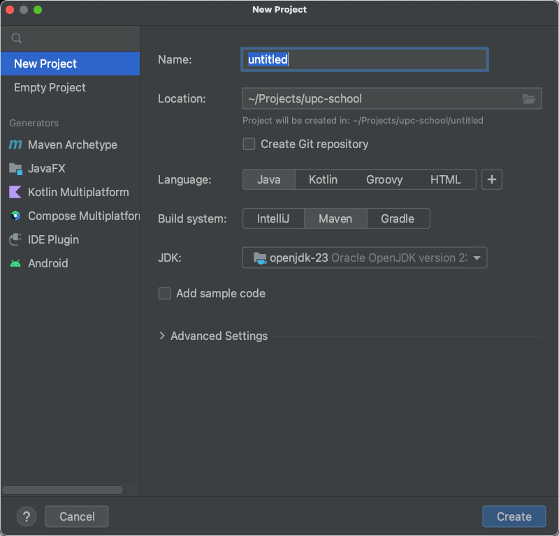
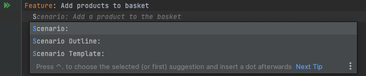
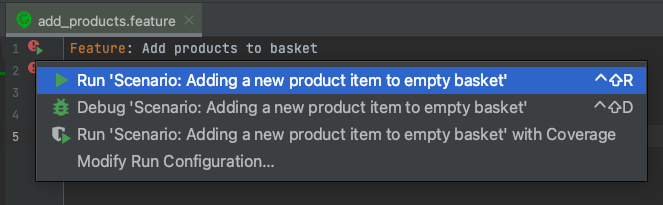
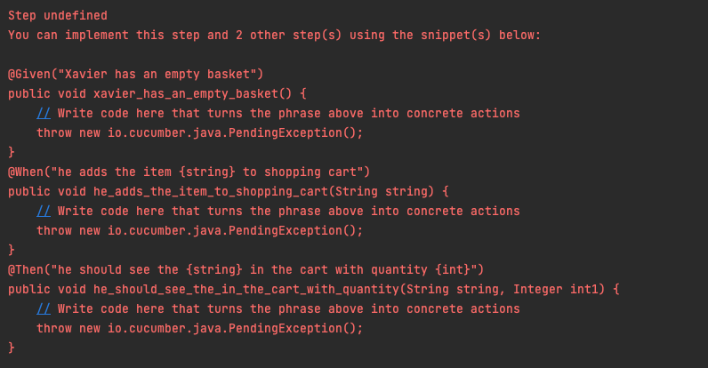
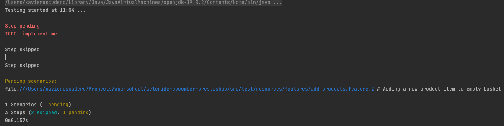
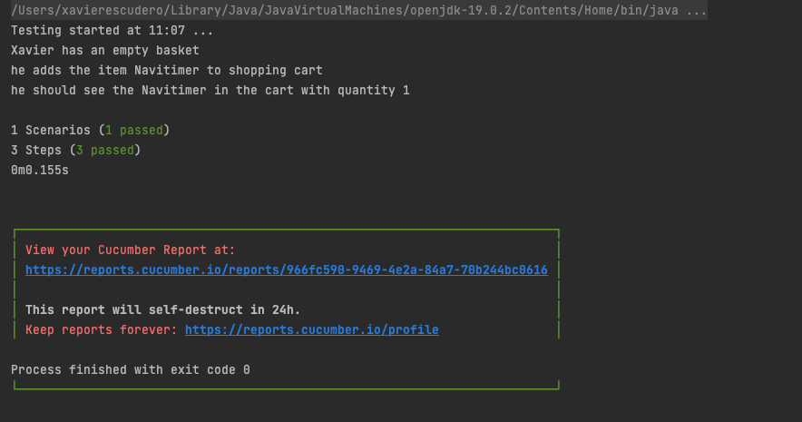

# Walktrough

This is a walkthrough for the code in this repository. It is intended to help you understand how the code works and how to use it.

## Create a new Maven project

Create from Intellij IDEA a new project Maven based.




Replace your pom.xml with the one in this repository:

```xml
<project xmlns="http://maven.apache.org/POM/4.0.0" xmlns:xsi="http://www.w3.org/2001/XMLSchema-instance"
         xsi:schemaLocation="http://maven.apache.org/POM/4.0.0 http://maven.apache.org/xsd/maven-4.0.0.xsd">
    <modelVersion>4.0.0</modelVersion>

    <groupId>org.example</groupId>
    <artifactId>selenide-cucumber-prestashop</artifactId>
    <version>1.0-SNAPSHOT</version>
    <packaging>jar</packaging>

    <name>selenide-cucumber-prestashop</name>
    <url>http://maven.apache.org</url>

    <properties>
        <maven.compiler.source>8</maven.compiler.source>
        <maven.compiler.target>8</maven.compiler.target>
        <project.build.sourceEncoding>UTF-8</project.build.sourceEncoding>
        <cucumber-java.version>7.11.2</cucumber-java.version>
        <cucumber-junit.version>7.11.2</cucumber-junit.version>
        <selenide.version>7.2.3</selenide.version>
        <assertj-core.version>3.25.3</assertj-core.version>
        <maven-surefire-plugin.version>3.2.5</maven-surefire-plugin.version>
        <allure-cucumber7-jvm.version>2.29.1</allure-cucumber7-jvm.version>
        <allure-maven.version>2.11.2</allure-maven.version>
    </properties>


    <dependencies>
        <!-- https://mvnrepository.com/artifact/io.cucumber/cucumber-java -->
        <dependency>
            <groupId>io.cucumber</groupId>
            <artifactId>cucumber-java</artifactId>
            <version>${cucumber-java.version}</version>
        </dependency>

        <!-- https://mvnrepository.com/artifact/io.cucumber/cucumber-junit -->
        <dependency>
            <groupId>io.cucumber</groupId>
            <artifactId>cucumber-junit</artifactId>
            <version>${cucumber-junit.version}</version>
            <scope>test</scope>
        </dependency>

        <!-- https://mvnrepository.com/artifact/com.codeborne/selenide -->
        <dependency>
            <groupId>com.codeborne</groupId>
            <artifactId>selenide</artifactId>
            <version>${selenide.version}</version>
        </dependency>

        <!-- https://mvnrepository.com/artifact/org.assertj/assertj-core -->
        <dependency>
            <groupId>org.assertj</groupId>
            <artifactId>assertj-core</artifactId>
            <version>${assertj-core.version}</version>
            <scope>test</scope>
        </dependency>

        <!-- https://mvnrepository.com/artifact/io.qameta.allure/allure-cucumber-jvm -->
        <dependency>
            <groupId>io.qameta.allure</groupId>
            <artifactId>allure-cucumber7-jvm</artifactId>
            <version>${allure-cucumber7-jvm.version}</version>
        </dependency>

    </dependencies>
    <build>
        <pluginManagement>
            <plugins>
                <plugin>
                    <groupId>org.apache.maven.plugins</groupId>
                    <artifactId>maven-surefire-plugin</artifactId>
                    <version>${maven-surefire-plugin.version}</version>
                </plugin>
            </plugins>
        </pluginManagement>

        <plugins>
            <plugin>
                <groupId>io.qameta.allure</groupId>
                <artifactId>allure-maven</artifactId>
                <version>${allure-maven.version}</version>
            </plugin>
        </plugins>


    </build>

</project>
```

## Install Cucumber Plugin

Install the Cucumber plugin for IntelliJ IDEA. This will allow you to run Cucumber tests from the IDE.

Go to [https://plugins.jetbrains.com/plugin/7212-cucumber-for-java](https://plugins.jetbrains.com/plugin/7212-cucumber-for-java) and press the install button. You can also install it directly from IntelliJ IDEA.

## Create the feature files directory

Create a new directory called `src/test/resources/features` in your project. This is where you will put your feature files.

## Create a feature file

Create a new file called `add_products.feature` in the `src/test/resources/features` directory.

Look as in the tab of IntelliJ we see a Cucumber icon.

First autocomplete the file using first `Feature` and `Scenario` keywords. 

You can do this by typing `F` and setting `Add products to basket` as the name of the feature. 

Then type `S` and set `Adding a new product item to empty basket` as the name of the scenario.



Use also Given, When and Then keywords to autocomplete the steps.

```gherkin
Feature: Add products to basket
  Scenario: Adding a new product item to empty basket
    Given Xavier has an empty basket
    When he adds the item "Navitimer" to shopping cart
    Then he should see the "Navitimer" in the cart with quantity 1
```

## Execute the scenario

From the feature file, right click on the scenario and select "Run Scenario 'Adding a new product item to empty basket'".



You'll see the next error in console:




## Create the step definitions directory and class

Create a new package `src/test/java/com/upc/prestashop/stepdefinitions` in your project. This is where we will put the step definitions.

Creata a new class `CartStepDefinitions.java` in the `src/test/java/com/upc/prestashop/stepdefinitions` directory.

```java
package com.upc.prestashop.stepdefinitions;

public class CartStepDefinitions {
}
```

Copy the code from console and paste inside the class. 

```java
package com.upc.prestashop.stepdefinitions;

import io.cucumber.java.en.Given;
import io.cucumber.java.en.Then;
import io.cucumber.java.en.When;

public class CartStepDefinitions {
    @Given("Xavier has an empty basket")
    public void xavier_has_an_empty_basket() {
        // Write code here that turns the phrase above into concrete actions
        throw new io.cucumber.java.PendingException();
    }
    @When("he adds the item {string} to shopping cart")
    public void he_adds_the_item_to_shopping_cart(String string) {
        // Write code here that turns the phrase above into concrete actions
        throw new io.cucumber.java.PendingException();
    }
    @Then("he should see the {string} in the cart with quantity {int}")
    public void he_should_see_the_in_the_cart_with_quantity(String string, Integer int1) {
        // Write code here that turns the phrase above into concrete actions
        throw new io.cucumber.java.PendingException();
    }
}
```

Re-execute again the scenario from the feature file. Now, the error is different:



It says now we need to implement the steps.

## Implement the steps (easy first)

Add a print statement for each step instead throwing a PendingException.

```java
public class CartStepDefinitions {
    @Given("Xavier has an empty basket")
    public void xavier_has_an_empty_basket() {
        System.out.println("Xavier has an empty basket");
    }
    @When("he adds the item {string} to shopping cart")
    public void he_adds_the_item_to_shopping_cart(String string) {
        System.out.println("he adds the item " + string + " to shopping cart");
    }
    @Then("he should see the {string} in the cart with quantity {int}")
    public void he_should_see_the_in_the_cart_with_quantity(String string, Integer int1) {
        System.out.println("he should see the " + string + " in the cart with quantity " + int1);
    }
}
```

Re-execute the scenario from the feature file.



Now, everything is green.

## Create the Cucumber runner

If we use the Cucumber plugin, we can run the tests from the feature file, but if we need
to execute the tests from the command line or the pipeline, we need to create a Cucumber runner.

Create a package `src/test/java/com/upc/prestashop/runners` in your project. This is where we will put the Cucumber runner.

Create a new class `CucumberRunner.java` in the `src/test/java/com/upc/prestashop/runners` directory.

```java
package com.upc.prestashop.runners;

import io.cucumber.junit.Cucumber;
import io.cucumber.junit.CucumberOptions;
import org.junit.runner.RunWith;

/**
 * Runner class
 */
@RunWith(Cucumber.class)
@CucumberOptions(
        plugin = {
                "pretty",
                "io.qameta.allure.cucumber7jvm.AllureCucumber7Jvm",
        },
        features = "./src/test/resources/features",
        glue = {"com.upc.prestashop.stepdefinitions"}
)
public class CucumberRunner {
}
```

We're going to use Allure for reporting, but you can use any other reporting integration.

Create in `test\resources` a new file `allure.properties` with the following content:

```properties
allure.results.directory=target/allure-results
```

From IDE run the CucumberRunner class.


## Implement the real steps with Selenium

Now we need to implement the steps with Selenium and Selenide (optional).


